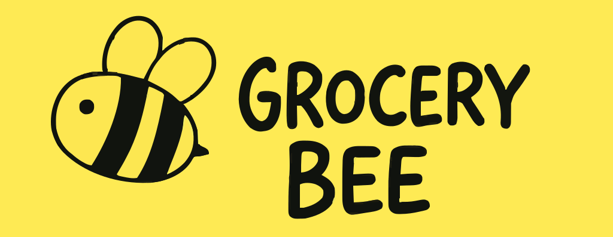
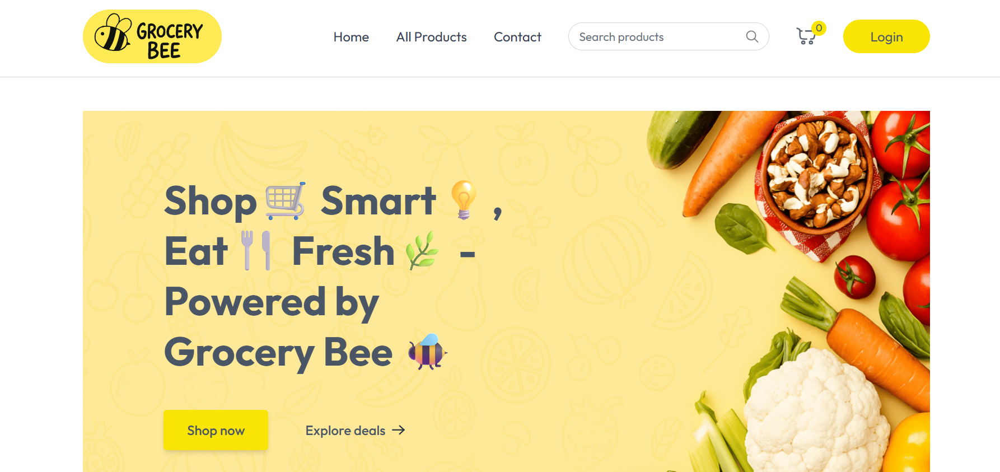
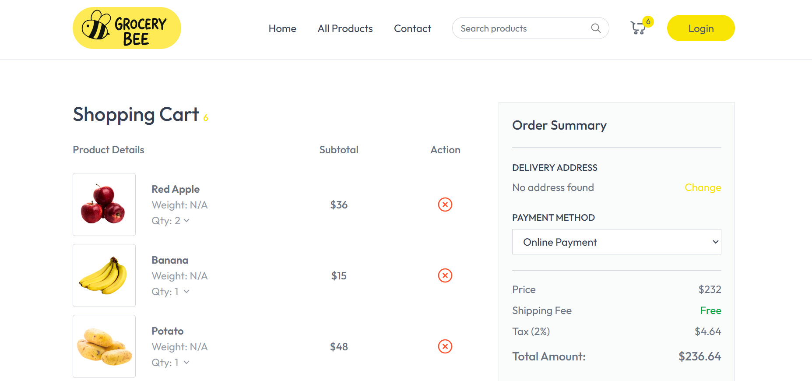

# Grocery Bee 🛒

  

Grocery Bee is a full-stack e-commerce web app for an online grocery store, built with the **MERN stack**. Users can browse, search, and buy groceries through a responsive interface.

🔗 **Live App**: [https://grocerybee-frontend.vercel.app/](https://grocerybee-frontend.vercel.app/)

---

## 📸 Screenshots

---

## 📦 Tech Stack
- **Frontend**: React.js, Vite, TailwindCSS, Axios, React Router DOM, React Hot Toast
- **Backend**: Node.js, Express.js, MongoDB (Mongoose), Cloudinary, Stripe, JWT, Bcrypt.js, Multer
- **Tools**: Git, ESLint, dotenv

---

## 🚀 Getting Started

See the [Setup Guide](./docs/setup-guide.md) for installation and development instructions.

---

## 🌟 Features
- Browse and search groceries
- Manage cart and checkout
- Secure payments with Stripe
- User authentication with JWT
- Image uploads via Cloudinary
- Responsive UI with TailwindCSS
- Real-time notifications

---

## 🚀 Deployment
- **Frontend**: Deploy `client/dist` to Vercel/Netlify. Set `VITE_BACKEND_URL`.
- **Backend**: Deploy `server` to Heroku/Render. Configure env vars.

---

## 🤝 Contributing
1. Fork the repo.
2. Create a branch: `git checkout -b feature/your-feature`.
3. Commit changes: `git commit -m 'Add feature'`.
4. Push: `git push origin feature/your-feature`.
5. Open a pull request.

---

## 📈 Roadmap
- Order tracking
- User profiles
- Advanced search
- Admin dashboard

---

## 📝 Notes
- Add `.env` to `.gitignore`.
- Hash `SELLER_PASSWORD` with `bcryptjs` in production.
- Test setup on a fresh environment.
- Update `your-username` in the clone command.

---

## 📜 License
Licensed under the ISC License. See [LICENSE](LICENSE).

---
