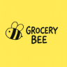

# Grocery Bee 🛒

<p align="center">
  
</p>

Grocery Bee is a full-stack e-commerce web application designed for an online grocery store. It enables users to browse, search, and purchase grocery items seamlessly, with a modern and responsive user interface.

This project is built using the **MERN Stack**:

- **MongoDB** for database
- **Express.js** as the backend framework
- **React.js + Vite** for the frontend
- **Node.js** for the server runtime

---

## 📦 Tech Stack

- **Frontend:** React (with Vite), TailwindCSS (or CSS framework of your choice)
- **Backend:** Node.js, Express.js
- **Database:** MongoDB
- **Linting:** ESLint
- **Version Control:** Git + GitHub

---

## 🚀 Getting Started

### 1. Clone the repository

```bash
git clone git@github.com:your-username/GroceryBee.git
cd GroceryBee
